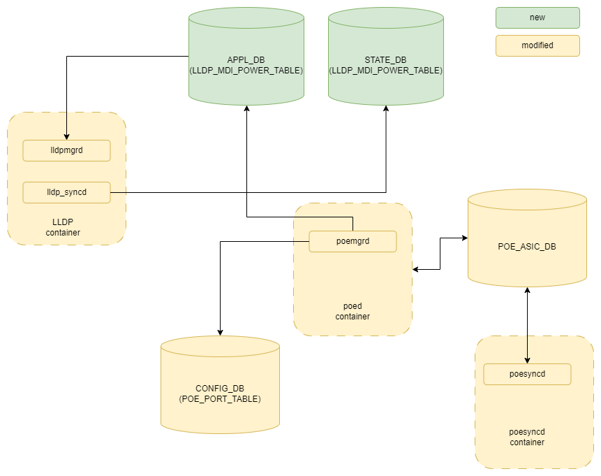

# SONiC PoE #

## Table of Content 

- [Revision](#revision)
- [Scope](#scope)
- [Definition/Abbreviation](#definitions_abbreviations)
- [Overview](#overview)
- [Requirements](#requirements)
- [Architecture Design](#architecture-design)
  - [PoE interaction](#poe-interaction)
  - [SWSS changes](#swss-changes)
  - [PoE SYNCD](#poe-syncd)
  - [PoE Manager](#poe-manager)
  - [LLDP Manager](#lldp-manager-modified)
  - [LLDP Syncd](#lldp-syncd-modified)
- [High-Level Design](#high-level-design)
- [SAI API](#sai-api)
- [PoE AI](#poe-abstraction-interface)
- [Configuration and management](#configuration-and-management)
  - [CLI/YANG model Enhancements](#cli_yang-model-enhancements)
    - [Show commands](#show-commands)
    - [Config commands](#config-commands)
  - [Config DB Enhancements](#config-db-enhancements)
  - [Application DB Enhancements](#application-db-enhancements)
  - [State DB Enhancements](#state-db-enhancements)
- [Restrictions/Limitations](#restrictions_limitations)

### Revision

 | Rev | Date |     Author     | Change Description |
 |:---:|:----:|:--------------:|--------------------|
 | 0.1 | 11-07-2024 | Saravanan I |  Initial version |


### Scope  

This document provides general information about the PoE Power via MDI (Power over Ethernet) feature implementation in SONiC.

### Definitions/Abbreviations 

|                          |                                |
|--------------------------|--------------------------------|
| PoE                      | Power over Ethernet |
| MDI                      | Media Dependent Interface |
| LLDP                     | Link Level Disconvery Protocol |
| PD                       | Powered Devices |
| TLV                      | Type Length Value |
| PSE                      | Power Supplying Equipment |

### Overview 

SoNiC switches with PoE capability can be augmented to support Power via MDI functionality. Once the port connected to an PD reaches delivering power stage, PD can adjust it's power limit (called as Dynamic Power Limit) by exchanging LLDP packets to the switch. 


### Requirements

- Support new CLI configurations to enable or disable Power via MDI feature at individual port level as mentioned in [config section](#config-commands)
- Support in LLDP module to handle exchange of Power via MDI TLVs between PSE and PD

### Architecture Design 

#### PoE interaction

This section describes the detail interaction of PoE componnents, DB and PoE hardware (controller) in SONiC subsytem.



#### SWSS changes

To support setting dynamic power limit in ASIC, SWSS container needs to be enhanced to set the attribute in SAI.

#### PoE manager

PoE manager will need to  implement the following functionality:

- apply dynamic power limit configuration in PoE controller;
- Listen to the LLDP_MDI_POWER table in STATE_DB and then process the setting of dynamic power limit attribute in SAI via poesyncd. After setting the dynamic power limit, update the LLDP_MDI_POWER table in Application db to inform the PD about setting of dynamic power limt


#### LLDP manager (modified)

To exchange the PoE information with peer about power supply capability, the LLDP protocol is used. In case to support
that, LLDP manager is required to be modified as following:

- LLDP manager gets PoE information (from application PoE database).
- LLDP manager adds LLDP TLV with PoE information into LLDP packet.

#### LLDP syncd (modified)

To inform the PD's requirement of dynamic power limit,
LLDP syncd is required to be modified as following:

- LLDP syncd application appends the STATE DB with received TLVs from PD

### High-Level Design 

TBD

### SAI API 

- SAI API is defined and configured to set the dynamic power limit for PoE

### PoE Abstraction Interface

The PoE Manager uses a new SAI PoE library that implements the PoE Abstraction Interface.

#### Device Capabilities

#### Port Capabilities

| Capabilities       		 | SAI attributes                                |
| -------------------        | --------------------------------------------- |
| Dynamic Power Limit        | SAI_POE_PORT_ATTR_DYNAMIC_POWER_LIMIT         |

### Configuration and management 

#### Manifest (if the feature is an Application Extension)
Yes. This feature extends existing PoE functionalities to support Power via MDI capabilities.

#### CLI

##### Show commands
Existing show command is updated to display the dynamic power limit set.

- show poe interface \<ifname\>
```

Port         Status      En/Dis  Priority Protocol      Class  PWR Consump  PWR Limit   Voltage   Current DYN_PWR Limit
------------ ----------- ------- -------- ------------- ----- ------------ ---------- --------- --------- -------------
Ethernet0    delivering  enable  high     802.3BT/High      4      6.100 W   80.600 W  54.000 V   0.113 A     60.5 W
Ethernet1    delivering  enable  crit     802.3BT/High      4      6.500 W   80.600 W  54.000 V   0.120 A     60.5 W
Ethernet2    searching   enable  low      802.3BT/High      0      0.000 W   80.600 W   0.000 V   0.000 A     60.5 W
Ethernet3    searching   enable  crit     802.3BT/High      0      0.000 W   80.600 W   0.000 V   0.000 A     60.5 W
```

##### Config commands

- config poe interface power-via-mdi \<ifname\> {enable | disable}

Examples:
```
$ config poe interface power-via-mdi Ethernet0 enable
```

**TODO**: update CLI reference https://github.com/sonic-net/sonic-utilities/blob/master/doc/Command-Reference.md

#### YANG model Enhancements

TBD

#### Config DB Enhancements  

POE port table has been enhanced to support power via mdi capability:

##### POE_PORT_TABLE
~~~
    ;Stores PoE port configuration
    key         = POE_PORT|ifname         ; ifname with prefix POE_PORT
    ; field     = value
	power-via-mdi     = "enable" / "disable"    ; enable/disable PoE on port, default "disable"
~~~

#### Application DB Enhancements  

New table LLDP_MDI_POWER introduced in Application DB to enable to PoE application daemon to communicate with the DB. This DB will be subscribed by 
lldp manager to fill the power via mdi TLVs in LLDP protocol packets.

#### LLDP_MDI_POWER
~~~
    ; Defines LLDP TLV information to be sent to PD on receipt of Dynamic Power Limit request
	key         						= LLDP_MDI_POWER:ifname   								; ifname with prefix LLDP_MDI_POWER
    ; field     						= value
	standard							= "af"/"at"/"bt"										;POE standard advertised by PSE
	power-type							= "PSE"/												;Type advertised by PSE, value "PSE" is valid
										  "Type-1-PSE"/		 									when standard is "af", other values
										  "Type-2-PSE"		 									are valid when standard is "at"/"bt"
	power-source						= "Primary"/"Backup"									;Power source advertised by PSE
	power-priority						= "Unknown"/"Critical"/"High"/"Low						;Power priority advertised by PSE
	power-value							= 1*3.3DIGIT              								;Power consumed advertised by PSE,
																								field is applicable when standard is "af"
	mdi-power-supported			    	= BOOLEAN 												;MDI power negotiation is supported
																								in PSE or not, applicable when
																								standard is "af"
	mdi-power-support-state				= BOOLEAN 												;MDI power negotiation is supported 
																								in PSE or not, applicable when
																								standard is "af"
	pair-control						= BOOLEAN												;Pair control in PSE is supported or
																								not, set as "true" always
	power-pair							= "primary"/"secondary" /"both"		    				;Power pair in PSE 
	power-class							= "Class4"/"Class3"/"Class2"/"Class1"/"Class0"			;Power class advertised by
																								PSE, applicable when standard is "at"
	pd-requested-power			    	= STRING												;Requested power (in Milli watts) from PD, applicable when standard is "at"/"bt"
	pd-requested-power-primary			= STRING												;Requested power from PD on primary channel, 
																								applicable when standard is "bt"
	pd-requested-power-secondary		= STRING												;Requested power from PD on secondary
																								channel, applicable when poe-standard is "bt"
	pse-allocated-power					= STRING 												;Allocated power from PSE, applicable
																								when poe-standard is "at"/"bt"
	pse-allocated-power-primary			= STRING												;Allocated power from PSE on primary
																								channel, applicable when standard is "bt"
	pse-allocated-power-secondary		= STRING string											;Allocated power from PSE on secondary
																								channel, applicable when standard is "bt"
	power-type-extension				= "Type 3 PSE"/	"Type 4 PSE"							;Extended type advertised by PSE,
																								applicable when standard is "bt"
	pd-load								= STRING  												;Set as "0" always by PSE, applicable when standard is "bt"
	power-class-extension				= "Dual Signature PD"/"Class8"/"Class7"/"Class6"/
										  "Class5"/"Class4"/"Class3"/"Class2"/"Class1"          ;Power class advertised by PSE, applicable when standard is "bt"
	power-class-extension-primary		= "Single Signature PD"/								;Power class advertised by PSE on primary channel, applicable when
			 					          "Class5"/"Class4"/"Class3"/"Class2"/"Class1"			 standard is "bt"
	power-class-extension-secondary		= "Single Signature PD"/								;Power class advertised by PSE on primary channel, applicable when
			 					          "Class5"/"Class4"/"Class3"/"Class2"/"Class1"			 standard is "bt"
	pse-power-status					= "4-pair powering dual-signature PD"/					;Powered status advertised by PSE,
										  "4-pair powering single-signature PD"/	    		 applicable when standard is "bt"        
										  "2-pair powering"				 
	pd-powered-status					= STRING												;Set as "0" always by PSE, applicable when standard is "bt"
	pse-max-power						= STRING					1							;Maximum power available in PSE for this port, applicable when standard is "at"/"bt"
~~~

#### STATE DB Enhancements  

New table LLDP_MDI_POWER introduced in State DB. This table will be written by LLDP manager daemon after processing incoming LLDP TLVs from PD. And, the PoE application after listening to this table, will process and configure the same in hardware using SAI.

#### LLDP_MDI_POWER
~~~
    ; Defines LLDP TLV information to be sent to PD on receipt of Dynamic Power Limit request
	key         						= LLDP_MDI_POWER:ifname   								; ifname with prefix LLDP_MDI_POWER
    ; field     						= value
	standard							= "af"/"at"/"bt"										;POE standard advertised by PD
	power-type							= "PD"/"Type-1-PD"/"Type-2-PD"							;Type advertised by PD, value "PD" is 	  valid when standard is "af", other values are valid when standard is "at"/"bt"
	power-source						= "Primary"/"Backup"									;Power source advertised by PD
	power-priority						= "Unknown"/"Critical"/"High"/"Low						;Power priority advertised by PD
	power-value							= 1*3.3DIGIT              								;Power consumed advertised by PD,
																								field is applicable when standard is "af"
	mdi-power-supported			    	= STRING 												;Set as "0" always as per IEEE 802.3 Standard
	mdi-power-support-state				= STRING 												;Set as "0" always as per IEEE 802.3 Standard
	pair-control						= STRING												;Set as "0" always as per IEEE 802.3 Standard
	power-pair							= STRING		    									;Set as "0" always as per IEEE 802.3 Standard
	power-class							= STRING												;Set as "0" always as per IEEE 802.3 Standard
	pd-requested-power			    	= STRING												;Requested power (in Milli watts) from PD, applicable when standard is "at"/"bt"
	pd-requested-power-primary			= STRING												;Requested power from PD on primary channel, 
																								applicable when standard is "bt"
	pd-requested-power-secondary		= STRING												;Requested power from PD on secondary
																								channel, applicable when poe-standard is "bt"
	pse-allocated-power					= STRING 												;Allocated power from PSE, applicable
																								when poe-standard is "at"/"bt"
	pse-allocated-power-primary			= STRING												;Allocated power from PSE on primary
																								channel, applicable when standard is "bt"
	pse-allocated-power-secondary		= STRING string											;Allocated power from PSE on secondary
																								channel, applicable when standard is "bt"
	power-type-extension				= "Type 3 PSE"/	"Type 4 PSE"							;Extended type advertised by PD,
																								applicable when standard is "bt"
	pd-load								= "Single Signature"/"Dual Signature"  					;Signature type advertised by PD,  applicable when standard is "bt"
	power-class-extension				= "Dual Signature PD"/"Class8"/"Class7"/"Class6"/
										  "Class5"/"Class4"/"Class3"/"Class2"/"Class1"          ;Power class advertised by PD, applicable when standard is "bt"
	power-class-extension-primary		= "Single Signature PD"/								;Power class advertised by PD on primary channel, applicable when
			 					          "Class5"/"Class4"/"Class3"/"Class2"/"Class1"			 standard is "bt"
	power-class-extension-secondary		= "Single Signature PD"/								;Power class advertised by PD on primary channel, applicable when
			 					          "Class5"/"Class4"/"Class3"/"Class2"/"Class1"			 standard is "bt"
	pse-power-status					= "4-pair powering dual-signature PD"/					;Powered status advertised by PD,
										  "4-pair powering single-signature PD"/	    		 applicable when standard is "bt"        
										  "2-pair powering"				 
	pd-powered-status					= STRING												;Set as "0" always by PD, applicable when standard is "bt"
	pse-max-power						= STRING					1							;Set as "0" always by PD, applicable when standard is "at"/"bt"
~~~


#### POE_PORT_STATE_TABLE
    ; Defines information for a PoE port state
    key         		= POE_PORT_STATE|ifname   ; ifname with prefix POE_PORT_STATE
    ; field     		= value
    dynamic_pwr_limit   = 1*3.3DIGIT              ; dynamic power limit of the PoE port set via LLDP message


### Warmboot and Fastboot Design Impact  

Post reboot, the PD can again exchange message with PSE to finetune it's power requirements.

### Memory Consumption
This sub-section covers the memory consumption analysis for the new feature: no memory consumption is expected when the feature is disabled via compilation and no growing memory consumption while feature is disabled by configuration. 

### Restrictions/Limitations  

### Testing Requirements/Design  

Testing of PoE functionality are covered by unit & system testing.

#### Unit Test cases

PoE components (like PoE syncd, REDIS API) can be validated and covered by mocking PoE SAI API. The existing syncd unit tests will be enhanced to validate the power via MDI TLVs.

#### System Test cases

TBD

### Open/Action items

- Update the High Level Design with System Flows.